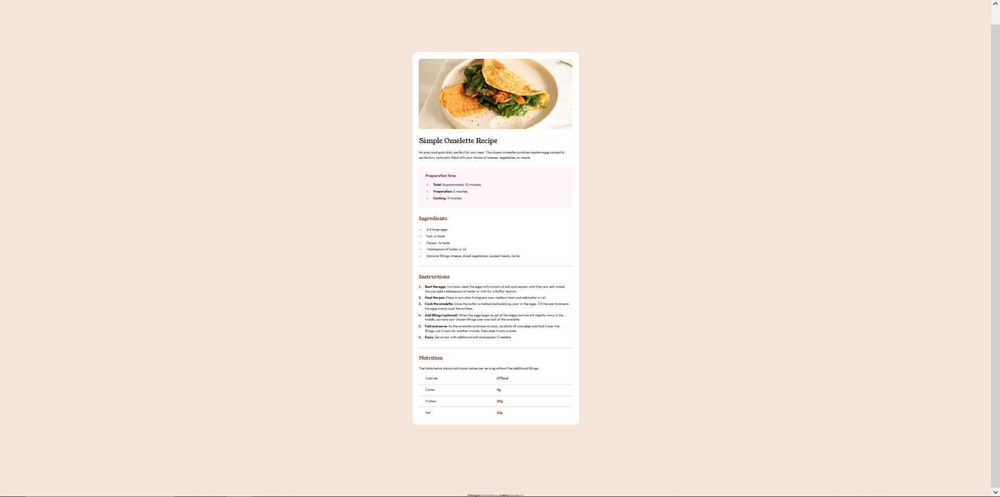

# Frontend Mentor - Recipe page solution

This is a solution to the [Recipe page challenge on Frontend Mentor](https://www.frontendmentor.io/challenges/recipe-page-KiTsR8QQKm). Frontend Mentor challenges help you improve your coding skills by building realistic projects.

## Table of contents

- [Overview](#overview)
  - [Screenshot](#screenshot)
  - [Links](#links)
- [My process](#my-process)
  - [Built with](#built-with)
  - [What I learned](#what-i-learned)
  - [Continued development](#continued-development)
  - [Useful resources](#useful-resources)
- [Author](#author)

## Overview

### Screenshot

### Links

- Solution URL: [Add solution URL here](https://your-solution-url.com)
- Live Site URL: [Add live site URL here](https://your-live-site-url.com)

## My process

### Built with

- Semantic HTML5 markup
- Flexbox
- <table>

### What I learned

I learned how hard it is to add responsiveness to certain elements if you don't plan ahead, forcing me to use some sketch workaround. I got there, but it wasn't easy. I learned that there are a lot of answers to really specific questions on the web, and I was able to google away 90% of my problems.
I also learned about "calc()", and other nifty things, namely the "::marker" pseudo-element. I believe this solidified my CSS skills further than the last project I did for [Frontendmentor](https://www.frontendmentor.io/).

### Continued development

There's probably some code inconsistency I overlooked here and there, but mostly I feel like it was me shooting myself in the foot for not designing the page "mobile-first, desktop-second", because half my time was spent trying to figure out how to properly set up responsiveness.
One thing I do want to explicitly learn is: How to do a table-like layout without using <table>. There's got to be a better or more "modern" way.

### Useful resources

Nothing particularly groundbreaking gleamed, besides a quick google search or two. If I would've found a better way to do tables, I would've put it here.

## Author

- Website - [HyperBanner](https://github.com/HyperBanner/recipe-page)
- Frontend Mentor - [@HyperBanner](https://www.frontendmentor.io/profile/HyperBanner)
